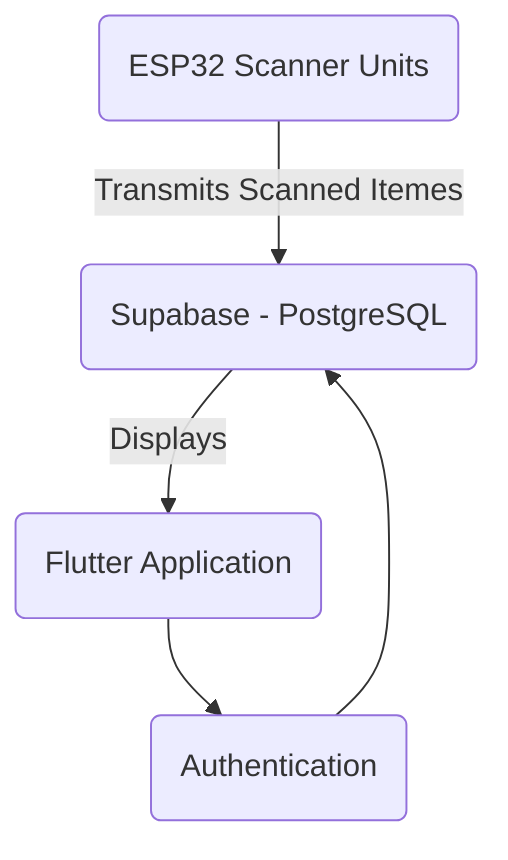
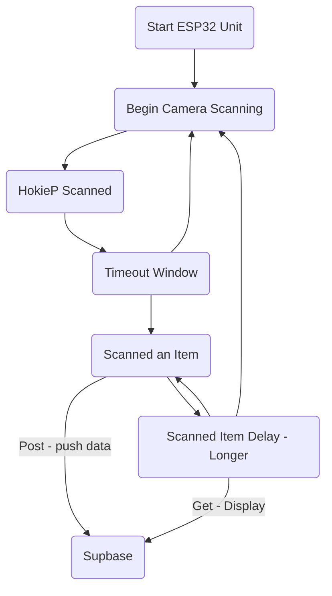

# Group3IncentivesEsp32

C++ with ESP32 that connects to Wi-Fi and sends posts to Supabase.

Also responsible for displaying to an 16x2 LCD screen information upon scan. 

---

# Overall Software Design

# Scanner Unit Process

